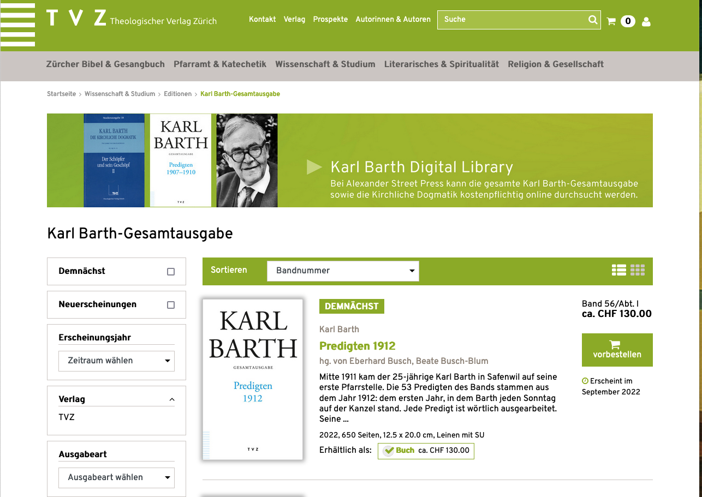
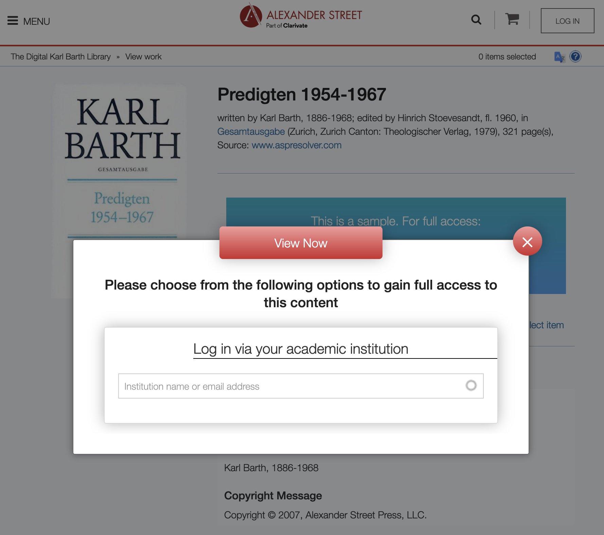

## Ausgangslage 

- Gedruckte Ausgabe
- The Digital Karl Barth Library
- Karl Barth-Archiv

%--
### Gedruckte Ausgabe 
<small>https://www.tvz-verlag.ch/wissenschaft-und-studium-editionen/karl-barth-gesamtausgabe/c-97</small>

<section data-visibility="hidden">
### Gedruckte Ausgabe 
#### Abteilungen 

I. Predigten

II. Akademische Werke

III. Vorträge und kleinere Arbeiten

IV. Gespräche

V. Briefe

VI. Aus Karl Barths Leben

</section>
<section data-visibility="hidden">
### Gedruckte Ausgabe
- Erscheint im Theologischen Verlag Zürich
- Über 55 Bände bereits gedruckt (beeindruckend)
- Gedruckte Ausgabe soll zu Ende geführt werden, wie anfangs geplant
- Viele Entscheidungen bereits getroffen (Editionsrichtlinien)
- Manches steht im Kontext einer ausschliesslich gedruckten Ausgabe und manche im Kontext einzelner Bände 
</section>

%--
### The Digital Karl Barth Library (Alexander Street Press) (I)
https://search.alexanderstreet.com/bart

- Volltexte mit ausgeklügelten Suchmöglichkeiten
- Enthält auch die «Kirchliche Dogmatik» und andere Werke!
- Gesamtausgabe ist bis Band 47 online

Note:
Da hier die Kirchliche Dogmatik ebenfalls Teil der Edition ist, wird die Digital Library noch längere Zeit ein wichtiges Hilfsmittel bleiben. Allerdings: 

%--

Note:
Die Digital Karl Barth Library ist kostenpflichtig. Damit ist der Zugang leider erschwert. Auch gibt es keinen Zugang zu den Daten direkt.

Für uns wichtiger ist, dass wir die Daten der ersten 36 Bände der Gesamtausgabe kaufen konnten. Damit haben wir eine einfache Version der Texte bereits, was ein hervorragender Ausgangspunkt war, um starten können.

%--
### Karl Barth-Archiv

