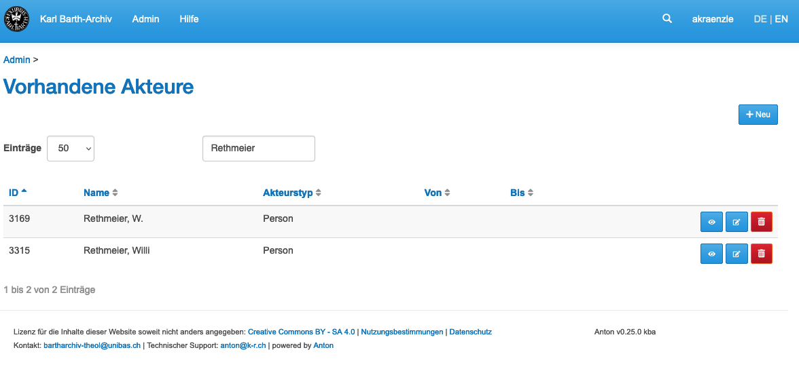
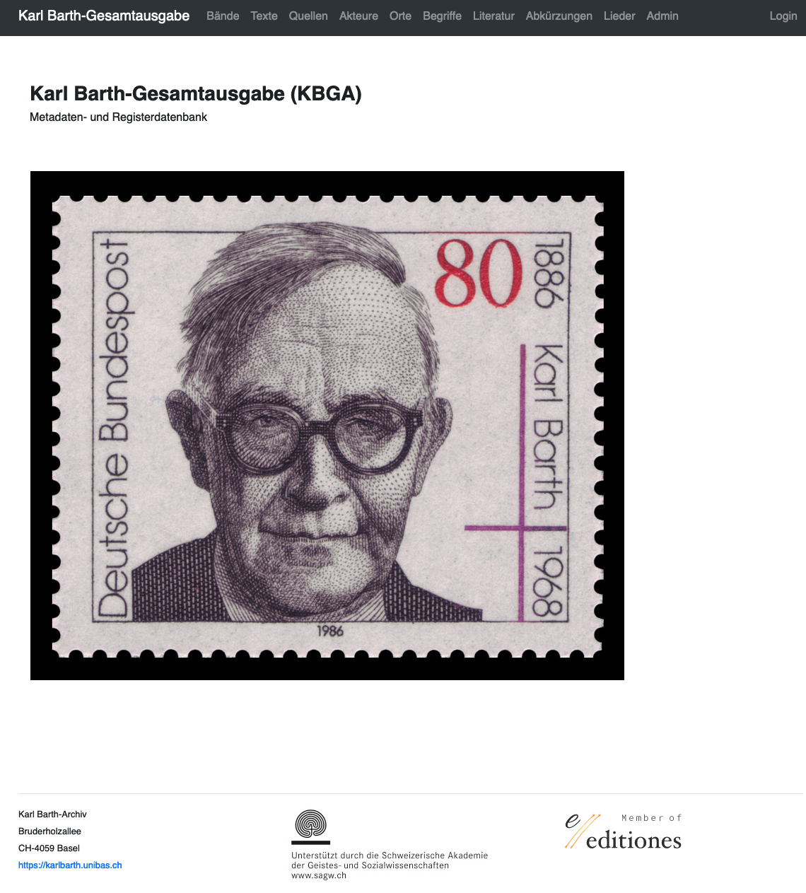

## Making
- KBA Online
- Luther API
- Editionsdaten

%--
### Datenbank des KBA
<small>https://kba.karl-barth.ch/</small>


%--

### Datenbank des KBA

<small>
<table class="table">
    <tr><td>Verzeichnungseinheiten (grösster Anteil Briefe)</td><td align="right">90 000</td></tr>
    <tr><td>Akteure (Personen und Organisationen)</td><td align="right">20 000</td></tr>
    <tr><td>Orte</td><td align="right">5 000</td></tr>
    <tr class="fragment"><td>Dokumente, Fotografien und Tonaufnahmen (digital!)</td><td align="right">88 000</td></tr>
</table>
</small>


<section data-visibility="hidden">
#### Beispiel für nicht bereinigten Akteur im KBA
<small>https://kba.karl-barth.ch/actors?search=Rethmeier</small>


</section>

%--
###  Lutherbibel von 1912
<small>https://luther.k-r.ch/</small>
<small>https://luther.k-r.ch/example</small>

<small>

```https://luther.k-r.ch/gen/1/1```

</small>


%--
## Daten der KGBA
- Texte
- Metadaten 
- Register
 
%--
### Datenformat
Basis und Endformat


%--

### Beispiel TEI: 

<!--aus 56019.xml-->

"In kaum sechs Tagen sollten sie New York 
erreichen und der Kapitän wusste: 
je schneller desto besser..."

<span class="fragment fade-in-then-out">

```xml
In kaum sechs Tagen sollten sie <placeName>New York</placeName> 
erreichen und der <persName>Kapitän</persName> wusste: 
je schneller desto besser...
```
</span>

<span class="fragment fade-in-then-out">

```xml
In kaum sechs Tagen sollten sie <placeName ref="kbga-places-47">New York</placeName> 
erreichen und der <persName ref="kbga-actors-9049">Kapitän</persName> wusste: 
je schneller desto besser...
```
</span>


<span class="fragment fade-in-then-out">

```xml
In kaum sechs Tagen sollten sie 
<placeName ref="kbga-places-47">New York</placeName> 
erreichen und der <persName ref="kbga-actors-9049">Kapitän</persName>
<note xml:id="n06"><p> Der sehr erfahrene Kapitän der «Titanic», 
<persName ref="kbga-actors-9049">Edward J. Smith</persName> (1850–1912), 
war 1911/12 bereits auf den aufsehenerregenden ersten Fahrten der 
«<term ref="kbga-terms-1604">Olympic</term>» deren Kapitän gewesen.</p>
</note> wusste: je schneller, um so besser...
```
</span>

%--
### Workflow Daten


%--
### Meta- und Registerdatenbank

<small>https://meta.karl-barth.ch</small>

 


