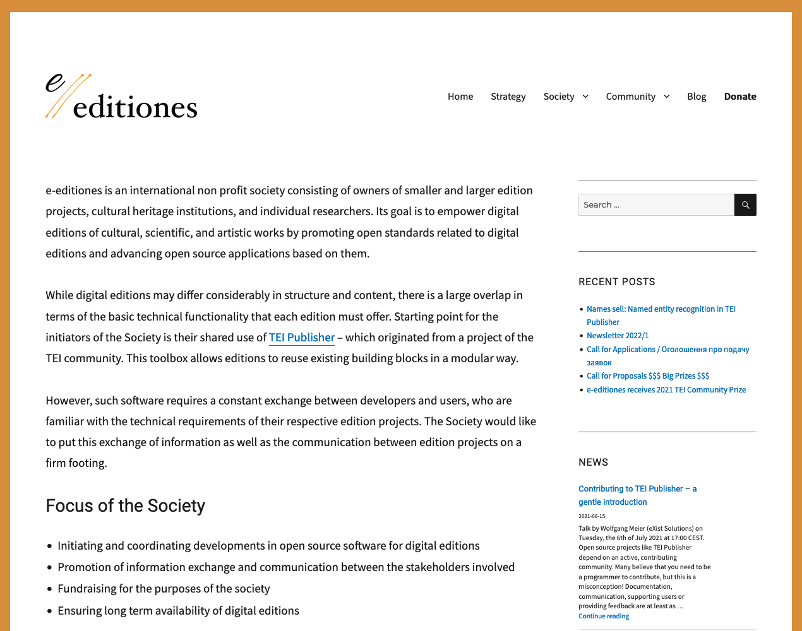
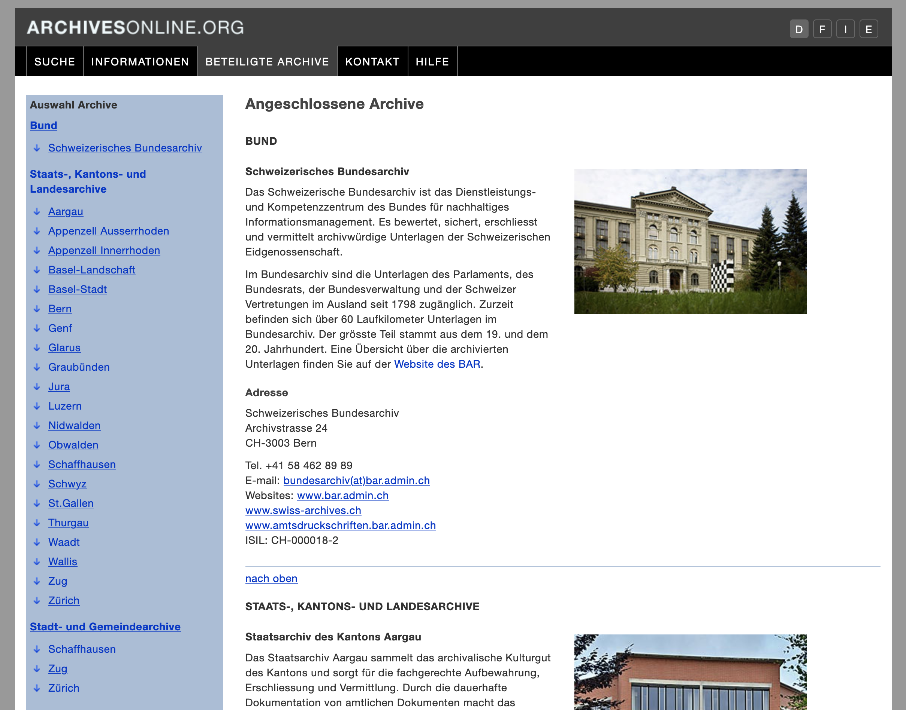

## Keeping
- Daten
- Applikation

%--
### Strategie 
Data first

<po class="fragment">
Fallschirm: gedruckte Ausgabe
</po>

%-- 
### Daten

%--
#### Github

<small>https://github.com/Karl-Barth/kbga-edition-data</small>

%--
#### FAIR

%--
### Gibt es eine nachhaltige Web-Applikation?
Nein

%-- 
#### TEI Processing Model

TEI mit ODD => Ausreichende Informationen um eine sinnvolle Edition zu (re-)konstruieren

%--
#### TEI Publisher
<small>https://teipublisher.com/index.html</small>

%--
#### e-editiones.org
<small>https://www.e-editones.org</small>

%--
#### Archives Online
<small>https://www.archives-online.org</small>

