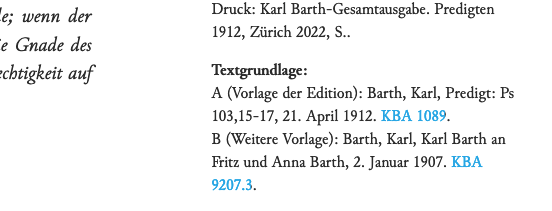

## Using
  <!--Browsen -->
  <!--Visualisierungen -->

  - Lesen
  - Forschen und Entdecken
  - Suchen und Browsen
  - APIs

%--
### Lesen
<small>https://kbga.karl-barth.ch/status</small>

Online:
-	Der Briefwechsel Barth – Bultmann (Band 1)
-	Predigten 1912, 1914, 1915, 1916 und 1954–1967 
-	Vorträge und kleinere Arbeiten 1935–1937

%-- 
### Ausstattung der Texte
<small>https://kbga.karl-barth.ch/texts/55016</small>
- Registereinträge am Rand: Personen, Organisationen, Orte, Begriffe, Bibelstellen
- Im Text: Personen, Organisationen, Orte, Bibelstellen, Literatur, Lieder
- Fussnoten werden eingeblendet
- Textgrundlagen werden angezeigt und verlinkt
- Querverweise in der KBGA sind verlinkt 


%--
### Forschen und Entdecken: Originale im Karl Barth-Archiv
<small>https://kbga.karl-barth.ch/texts/56019</small>


%-- 
### Suchen und Browsen
<small>https://lucene.apache.org/core/2_9_4/queryparsersyntax.html</small>

Operatoren: 
```xml
Bultmann AND Gogarten
Bultmann OR Gogarten
(Bultmann OR Gogarten) NOT Brunner
```
Wildcards, Fuzzy Search, NEAR:
```xml
Me?er NOT Meter: Meier, Meyer usw.
Tambach~: Tambach, Tambacher
"Brunner Bultmann"~4
```

%-- 
#### Facets und Register
- Personen
- Orte
- Begriffe (ab Band 55)
- Text-Typ
- Band

%--
#### Personenregister
<small>https://kbga.karl-barth.ch</small>
- Gemeinsame Normdatei (GND) 
- Wikipedia 

%--
#### Ortsregister
<small>https://kbga.karl-barth.ch/places/</small>
<small>https://www.geonames.org/12470270</small>
- Geonames (eigene neue Einträge)
- Wikipedia

%--
### API: Metagrid
<small>https://metagrid.ch/</small>


%--
### API: CorrespSearch  
<small>https://correspsearch.net</small>


%---

Danke an alle die mitgeholfen die Arbeit bis hierher ermöglicht haben!!!
